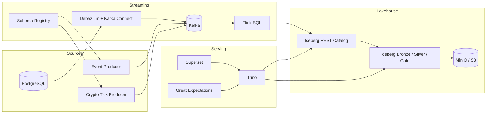

# Realtime Lakehouse Mini Platform (CDC + Streaming + Iceberg)

PostgreSQL OLTP 변경 데이터, 애플리케이션 이벤트, 그리고 crypto tick market data를 Kafka로 표준화하고, Flink 스트리밍 처리로 Iceberg 레이크하우스에 적재한 뒤 Trino, Superset, Great Expectations까지 연결한 로컬 재현형 end-to-end 데이터 플랫폼입니다.

이 프로젝트는 "CDC", "Kafka topic 설계", "Schema Registry", "Exactly-once", "Iceberg Lakehouse", "Medallion", "DQ", "대시보드 데모"를 한 번에 설명할 수 있도록 포트폴리오와 면접을 목표로 설계했습니다.

## Why This Project

- Postgres CDC, 앱 이벤트, market tick stream을 하나의 플랫폼으로 통합했습니다.
- Kafka, Flink, Iceberg, Trino, Superset, Great Expectations까지 실제 운영에 가까운 흐름을 로컬에서 재현할 수 있습니다.
- 단순 적재가 아니라 bronze / silver / gold, 스키마 진화, 장애 복구, 타임 트래블, 데이터 품질 검증까지 설명할 수 있습니다.
- 로컬 MinIO + Iceberg REST Catalog 기반이지만, S3 + Glue + Athena 구조로 자연스럽게 확장할 수 있도록 설계했습니다.

## What Is Working

- PostgreSQL `orders / payments / refunds` 변경이 Debezium CDC로 Kafka 토픽에 반영됩니다.
- 앱 이벤트와 crypto tick stream은 Schema Registry 기반 Avro로 Kafka에 적재됩니다.
- Flink SQL이 Kafka를 읽어 Iceberg bronze / silver / gold 테이블을 스트리밍 갱신합니다.
- Trino에서 Iceberg 테이블 조회와 KPI 확인이 가능합니다.
- Great Expectations로 `gold.commerce_kpis_1m` 검증과 Data Docs 생성을 수행합니다.
- Flink 체크포인트가 반복적으로 성공하며 잡이 안정적으로 RUNNING 상태를 유지합니다.

검증 예시:

- `bronze.orders_cdc = 35`
- `bronze.payments_cdc = 18`
- `bronze.refunds_cdc = 9`
- `silver.order_events = 62`
- `gold.commerce_kpis_1m = 32`
- `bronze.crypto_ticks = 800`
- `silver.crypto_ticks_1s = 529`
- `gold.crypto_market_kpis_1m = 60`

## Architecture



상세 설계 문서:

- [docs/architecture.md](C:/clone_repo/Realtime-Lakehouse-Mini-Platform-CDC-Streaming-Iceberg-/docs/architecture.md)
- [docs/topic-and-schema-design.md](C:/clone_repo/Realtime-Lakehouse-Mini-Platform-CDC-Streaming-Iceberg-/docs/topic-and-schema-design.md)
- [docs/operations.md](C:/clone_repo/Realtime-Lakehouse-Mini-Platform-CDC-Streaming-Iceberg-/docs/operations.md)
- [docs/performance.md](C:/clone_repo/Realtime-Lakehouse-Mini-Platform-CDC-Streaming-Iceberg-/docs/performance.md)
- [docs/demo-script.md](C:/clone_repo/Realtime-Lakehouse-Mini-Platform-CDC-Streaming-Iceberg-/docs/demo-script.md)
- [docs/portfolio-playbook.md](C:/clone_repo/Realtime-Lakehouse-Mini-Platform-CDC-Streaming-Iceberg-/docs/portfolio-playbook.md)

## Data Flow

1. PostgreSQL `orders / payments / refunds` 변경이 WAL에 기록됩니다.
2. Debezium PostgreSQL Connector가 변경 로그를 읽어 Kafka CDC 토픽으로 발행합니다.
3. 앱 이벤트 producer가 클릭/검색/장바구니 이벤트를 Kafka에 Avro 형태로 적재합니다.
4. crypto tick producer가 `BTC-USD`, `ETH-USD`, `SOL-USD`, `XRP-USD` 체결 이벤트를 Kafka에 Avro 형태로 적재합니다.
5. Flink SQL이 Kafka source를 읽어 commerce와 market 데이터를 bronze / silver / gold Iceberg 테이블로 스트리밍 적재합니다.
6. Trino가 Iceberg 테이블을 SQL로 조회합니다.
7. Superset은 Trino를 통해 KPI 대시보드를 구성합니다.
8. Great Expectations는 gold 테이블을 검증하고 Data Docs를 생성합니다.

## Hiring-Focused Execution Steps

취업용 포트폴리오로 보여줄 때는 "동작한다"보다 "어떤 흐름과 운영 포인트를 설명할 수 있느냐"가 중요합니다. 아래 4가지는 README만 봐도 바로 설명할 수 있게 남겨둔 최소 강화 포인트입니다.

### 1. Clear Crypto Tick Flow

```text
Crypto Exchange WebSocket
        ↓
Kafka Topic (trades)
        ↓
Flink Streaming Job
- 1m window aggregation
        ↓
Iceberg Table (MinIO)
        ↓
Superset
```

이 프로젝트에서는 실제 거래소 WebSocket 대신 `scripts/produce-crypto-ticks.ps1`가 exchange feed를 시뮬레이션합니다. 면접에서는 아래처럼 설명하면 자연스럽습니다.

- simulated exchange feed가 `raw.event.market.crypto_ticks_v1`로 tick을 발행
- Flink가 1초 silver 집계와 1분 gold KPI를 계산
- Iceberg 테이블이 MinIO에 저장되고 Trino / Superset이 이를 조회

### 2. Add Measurable KPIs

README에 남길 값은 "실제 실행해서 다시 설명할 수 있는 수치"만 적는 편이 좋습니다.

- Throughput:
  - `~460 events/sec`
  - 측정값: `1000`개 crypto tick 발행, topic offset 증가량 `1000`, 총 실행 시간 `2.173s`
- Latency:
  - Flink checkpoint duration `24ms ~ 84ms`
  - 참고: 이 프로젝트의 dashboard freshness는 엔진 처리 시간보다 `1-minute tumbling window` 종료 시점에 더 크게 영향을 받음

측정 방법:

- Kafka publish throughput:
  - `docker exec rlmp-kafka kafka-get-offsets --bootstrap-server localhost:9092 --topic raw.event.market.crypto_ticks_v1`
  - `powershell -ExecutionPolicy Bypass -File .\scripts\produce-crypto-ticks.ps1 -Count 1000 -IntervalMs 0 -EventTimeStepMs 0`
  - 실행 전후 topic offset delta와 총 실행 시간을 비교
- Flink latency:
  - `docker compose logs flink-jobmanager --tail=200`
  - checkpoint duration 관찰
- Dashboard freshness:
  - `produced_at` vs `window_start` 또는 `window_end` 비교
  - 이 프로젝트는 event-time window를 사용하므로 "실제 wall-clock latency"와 "window-close latency"를 구분해서 설명하는 것이 중요

### 3. Failure Scenario Drills

면접에서 거의 반드시 나오는 질문이어서, README에 바로 답할 수 있는 형태로 남겨둡니다.

- Test 1: Kafka broker restart
  - 방법:
    - `docker restart rlmp-kafka`
    - `docker compose logs flink-jobmanager --tail=200`
  - 기대 결과:
    - source가 잠시 대기하거나 lag가 증가
    - broker 복구 후 Flink source / Kafka Connect가 다시 연결
  - 설명 포인트:
    - ingestion 경로가 끊겨도 저장된 checkpoint와 consumer offset을 기준으로 재연결 가능
- Test 2: Schema change
  - 방법:
    - nullable 필드 추가 예시: `coupon_id` 또는 새로운 optional metadata field
    - Schema Registry compatibility 유지
  - 기대 결과:
    - `BACKWARD_TRANSITIVE` 정책 하에서 producer / consumer 무중단 진화 가능
    - Iceberg add-column 패턴으로 downstream 테이블도 안전하게 확장 가능
  - 설명 포인트:
    - breaking change는 새 topic 또는 새 downstream table로 분리
- Test 3: Iceberg sink failure
  - 실제 관찰:
    - `CommitStateUnknownException` / REST catalog `500` 상황에서 Flink job이 `RESTARTING`으로 전환되고 task restart를 시도함
  - 설명 포인트:
    - exactly-once는 sink commit 성공이 전제이며, catalog / object storage 안정성도 함께 봐야 함
    - 운영에서는 commit retry, compaction schedule, 단일 sink fan-in 설계가 중요

### 4. Data Scale Test

stress generator로 손쉽게 데이터 규모를 키울 수 있습니다.

- 1M trades:

```powershell
powershell -ExecutionPolicy Bypass -File .\scripts\produce-crypto-ticks.ps1 -Count 1000000 -IntervalMs 0 -EventTimeStepMs 0
```

- 5M trades:

```powershell
powershell -ExecutionPolicy Bypass -File .\scripts\produce-crypto-ticks.ps1 -Count 5000000 -IntervalMs 0 -EventTimeStepMs 0
```

목표:

- stable pipeline
- no data loss
- Kafka lag 증가 추이 확인
- Flink restart / checkpoint durability 확인
- Iceberg compaction 필요 시점 파악

권장 측정 항목:

- topic offset delta
- Flink checkpoint duration
- container CPU / memory
- Trino query latency
- gold row 증가 여부

## Tech Stack

- Source OLTP: PostgreSQL 16
- CDC: Debezium PostgreSQL Connector + Kafka Connect
- Event Bus: Kafka
- Schema Management: Confluent-compatible Schema Registry
- Stream Processing: Apache Flink 1.20 SQL
- Lakehouse Table Format: Apache Iceberg
- Object Storage: MinIO
- Query Engine: Trino
- Dashboard: Apache Superset
- Data Quality: Great Expectations

## Why CDC

- 운영 DB를 직접 polling 하지 않고 변경분만 가져와 source 시스템 부하를 줄일 수 있습니다.
- 주문, 결제, 환불처럼 상태가 계속 바뀌는 도메인을 이벤트 스트림으로 전환하기 좋습니다.
- "초기 적재 + 지속 변경 반영" 구조를 한 번에 설명할 수 있어 면접 포인트가 명확합니다.
- Debezium을 쓰면 애플리케이션 코드 수정 없이 Postgres WAL 기반 CDC를 시연할 수 있습니다.

## Why Iceberg

- bronze / silver / gold를 같은 테이블 포맷 위에서 운영할 수 있습니다.
- snapshot과 metadata 기반이라 time travel, rollback, compaction 같은 lakehouse 개념을 설명하기 좋습니다.
- schema evolution과 partition evolution을 지원해 데이터 플랫폼 포맷으로 설득력이 높습니다.
- 로컬 MinIO와 클라우드 S3 모두에 같은 저장 계층 패턴을 유지할 수 있습니다.

## Benchmark

### Local Smoke Benchmark

아래 수치는 현재 로컬 환경에서 기능 검증과 안정성 확인 용도로 관찰한 값입니다.

- Kafka publish throughput: 약 `460 events/sec`
  - 측정 조건: `1000` crypto tick, `IntervalMs=0`, topic offset delta `1000`, 실행 시간 `2.173s`
- Flink checkpoint duration: 약 `24 ms ~ 84 ms`
- 검증 시점 적재 결과:
  - `bronze.orders_cdc = 35`
  - `bronze.payments_cdc = 18`
  - `bronze.refunds_cdc = 9`
  - `silver.order_events = 62`
  - `gold.commerce_kpis_1m = 32`
- 예시 KPI:
  - `orders_created = 4`
  - `gross_order_value = 669.8`
  - `payments_succeeded = 2`
  - `refund_amount = 89.9`

이 수치는 대규모 부하 테스트 결과가 아니라, end-to-end 파이프라인과 checkpoint 안정성 확인용 smoke benchmark입니다. dashboard freshness는 `1-minute tumbling window` 종료 시점에 영향을 크게 받기 때문에, 면접에서는 "엔진 처리 지연"과 "윈도우 기반 결과 반영 지연"을 분리해서 설명하는 편이 좋습니다.

### Scale-Up Benchmark Plan

면접 대비용으로는 아래처럼 "대규모 데이터 + 실시간 대시보드" 확장 계획까지 같이 설명하는 것이 좋습니다.

- 대상 데이터셋 후보:
  - crypto tick data
  - GitHub event dataset
  - stock trade data
- 목표 볼륨:
  - 약 `100M rows`
- 측정 지표:
  - CDC latency
  - end-to-end dashboard freshness
  - throughput (`events/sec`)
  - Kafka lag
  - Flink checkpoint time
  - Trino query latency

확장 버전 아키텍처 설명 예시:

`Kafka -> Flink -> Iceberg -> Trino -> Superset / Grafana`

crypto tick 버전 목표 예시:

- Throughput: `500+ events/sec`
- End-to-end dashboard freshness:
  - `window_end -> produced_at` 지표로 관리
  - 목표는 "window closure 후 low single-digit seconds"
- 저장 데이터 규모: `100M rows`
- 주요 집계:
  - `tick_count_1m`
  - `traded_volume_1m`
  - `traded_notional_1m`
  - `vwap_1m`
  - `price_volatility_1m`

## Reliability And Failure Scenarios

면접에서 거의 반드시 나오는 운영/장애 질문에 대비해 아래 시나리오를 설명할 수 있습니다.

### Exactly Once

- Flink checkpoint와 Iceberg sink를 함께 사용해 재시작 시 중복 적재를 최소화하도록 구성했습니다.
- 동일 Iceberg 테이블에 대한 복수 sink 경합은 단일 sink fan-in으로 정리했습니다.

### Schema Evolution

- App event는 Schema Registry 호환성 정책을 사용합니다.
- Iceberg는 nullable add-column 중심으로 안전하게 진화시킵니다.
- 예시 시나리오: `orders.coupon_id` 필드 추가

### Late Event

- event time과 watermark를 분리해 1분 KPI 집계를 수행합니다.
- 로컬 단일 partition 환경에서 idle source가 watermark를 막는 문제는 `table.exec.source.idle-timeout`으로 해결했습니다.

### Backfill

- Kafka 토픽 replay와 Iceberg 재적재 구조를 이용해 backfill 시나리오를 설명할 수 있습니다.
- 로컬 환경에서는 warehouse 초기화 후 토픽을 다시 읽게 하여 재처리 흐름을 검증했습니다.

### Failure Scenario: Kafka Down

- 증상:
  - Kafka Connect / Flink source 지연
  - Kafka consumer lag 증가
- 대응:
  - Kafka 복구 후 consumer lag 회복 여부 확인
  - Flink job과 connector 상태 점검
  - 필요 시 `docker compose logs flink-jobmanager --tail=200`로 source reconnect 흐름 확인

### Failure Scenario: Flink Restart

- 증상:
  - job failure 또는 container restart
- 대응:
  - Flink UI와 jobmanager 로그 확인
  - checkpoint 복구 여부 확인
  - `.\scripts\run-flink-sql.ps1`로 재배포
  - 실제 운영 설명 포인트:
    - sink commit이 실패하면 job이 `RESTARTING`으로 전환되고 task restart를 시도함

### Failure Scenario: Schema Change

- 증상:
  - producer / consumer schema 불일치
  - parse error 또는 sink schema mismatch
- 대응:
  - backward-compatible change인지 확인
  - breaking change면 새 topic 또는 새 downstream table로 분리
  - 추천 drill:
    - optional 필드 추가
    - Schema Registry 등록 성공 확인
    - Iceberg add-column 반영 여부 확인

## Quick Start

```powershell
Copy-Item .env.example .env
.\scripts\bootstrap.ps1
.\scripts\seed-postgres.ps1
.\scripts\produce-events.ps1 -Count 120 -IntervalMs 250
.\scripts\run-dq.ps1
```

## CMD Quick Start

Windows `cmd`에서 실행할 때는 아래 순서를 그대로 따라 하면 됩니다.

### 1. `cmd` 열기

- `Windows Terminal`
- `명령 프롬프트`
- `VS Code Terminal`에서 shell을 `Command Prompt`로 바꾼 경우

### 2. 프로젝트 폴더로 이동

```cmd
cd /d C:\clone_repo\Realtime-Lakehouse-Mini-Platform-CDC-Streaming-Iceberg-
```

이미 프롬프트가 아래처럼 보이면 이동이 끝난 상태입니다.

```cmd
C:\clone_repo\Realtime-Lakehouse-Mini-Platform-CDC-Streaming-Iceberg->
```

### 3. `.env` 만들고 스택 올리기

```cmd
copy .env.example .env
powershell -ExecutionPolicy Bypass -File .\scripts\bootstrap.ps1
```

정상이라면 아래 주소들이 열립니다.

- Kafka Connect: [http://localhost:8083](http://localhost:8083)
- Flink UI: [http://localhost:8082](http://localhost:8082)
- Superset: [http://localhost:8088](http://localhost:8088)
- MinIO: [http://localhost:9001](http://localhost:9001)

참고:

- `http://localhost:8083`는 웹 페이지가 아니라 Kafka Connect REST API라서 JSON이 보이면 정상입니다.

### 4. CDC 데이터 넣기

```cmd
powershell -ExecutionPolicy Bypass -File .\scripts\seed-postgres.ps1
```

정상이라면 `orders`, `payments`, `refunds` 결과가 출력됩니다.

### 5. 앱 이벤트 넣기

```cmd
powershell -ExecutionPolicy Bypass -File .\scripts\produce-events.ps1 -Count 120 -IntervalMs 250
```

### 6. Crypto Tick 이벤트 넣기

```cmd
powershell -ExecutionPolicy Bypass -File .\scripts\produce-crypto-ticks.ps1 -Count 600 -IntervalMs 10
```

이 스크립트는 기본적으로 `EventTimeStepMs=250`을 사용하므로 몇 초만 실행해도 1분 window KPI가 생성됩니다.

### 7. 최종 적재 확인

```cmd
docker compose exec -T trino trino --execute "SELECT 'bronze.orders_cdc', COUNT(*) FROM iceberg.bronze.orders_cdc UNION ALL SELECT 'bronze.payments_cdc', COUNT(*) FROM iceberg.bronze.payments_cdc UNION ALL SELECT 'bronze.refunds_cdc', COUNT(*) FROM iceberg.bronze.refunds_cdc UNION ALL SELECT 'bronze.crypto_ticks', COUNT(*) FROM iceberg.bronze.crypto_ticks UNION ALL SELECT 'silver.order_events', COUNT(*) FROM iceberg.silver.order_events UNION ALL SELECT 'silver.crypto_ticks_1s', COUNT(*) FROM iceberg.silver.crypto_ticks_1s UNION ALL SELECT 'gold.commerce_kpis_1m', COUNT(*) FROM iceberg.gold.commerce_kpis_1m UNION ALL SELECT 'gold.crypto_market_kpis_1m', COUNT(*) FROM iceberg.gold.crypto_market_kpis_1m"
```

정상이라면 `bronze`, `silver`, `gold` count가 모두 `0`보다 크게 나옵니다.

### 8. DQ 실행

```cmd
powershell -ExecutionPolicy Bypass -File .\scripts\run-dq.ps1
```

정상이라면 `success=True`가 출력되고 Data Docs가 생성됩니다.

### 9. 자주 보는 화면

- Flink 상태 확인: [http://localhost:8082](http://localhost:8082)
- Superset 로그인: [http://localhost:8088](http://localhost:8088)
  - `admin / admin`
- MinIO 로그인: [http://localhost:9001](http://localhost:9001)
  - `minio / minio12345`
- DQ 결과 파일: [quality/great_expectations/uncommitted/data_docs/local_site/index.html](C:/clone_repo/Realtime-Lakehouse-Mini-Platform-CDC-Streaming-Iceberg-/quality/great_expectations/uncommitted/data_docs/local_site/index.html)

### 10. 스택 끄기

```cmd
docker compose down
```

볼륨까지 지우고 완전히 초기화하려면:

```cmd
docker compose down -v
```

주요 접속 포인트:

- Kafka Connect: [http://localhost:8083](http://localhost:8083)
- Schema Registry: [http://localhost:8081](http://localhost:8081)
- Flink UI: [http://localhost:8082](http://localhost:8082)
- Trino: [http://localhost:8080](http://localhost:8080)
- Superset: [http://localhost:8088](http://localhost:8088)
- MinIO Console: [http://localhost:9001](http://localhost:9001)

## Default Accounts

기본 인증 정보:

- PostgreSQL
  - Host: `localhost`
  - Port: `5432`
  - DB: `commerce`
  - User: `postgres`
  - Password: `postgres`
- Superset
  - URL: [http://localhost:8088](http://localhost:8088)
  - User: `admin`
  - Password: `admin`
- MinIO Console
  - URL: [http://localhost:9001](http://localhost:9001)
  - User: `minio`
  - Password: `minio12345`

인증이 없는 엔드포인트:

- Kafka Connect: [http://localhost:8083](http://localhost:8083)
- Schema Registry: [http://localhost:8081](http://localhost:8081)
- Flink UI: [http://localhost:8082](http://localhost:8082)
- Trino UI: [http://localhost:8080](http://localhost:8080)
- Iceberg REST Catalog: [http://localhost:8181](http://localhost:8181)

## Component Guide

각 서비스의 역할:

- `postgres`
  - 주문, 결제, 환불 데이터를 저장하는 원천 OLTP 데이터베이스입니다.
- `connect`
  - Debezium PostgreSQL Connector를 실행하며 Postgres WAL 변경을 Kafka CDC 토픽으로 보냅니다.
- `kafka`
  - CDC 이벤트와 애플리케이션 이벤트를 전달하는 이벤트 버스입니다.
- `schema-registry`
  - Avro 스키마를 등록하고 호환성 정책을 관리합니다.
- `event-producer`
  - 클릭, 검색, 장바구니 같은 행동 이벤트와 crypto tick stream을 Kafka로 발행하는 producer입니다.
- `flink-jobmanager`
  - Flink 잡 스케줄링과 체크포인트 조율을 담당합니다.
- `flink-taskmanager`
  - Kafka source를 읽고 Iceberg 테이블에 실제 스트리밍 처리를 수행합니다.
- `minio`
  - Iceberg 데이터 파일과 메타데이터가 저장되는 S3 호환 오브젝트 스토리지입니다.
- `iceberg-rest`
  - Flink와 Trino가 같은 Iceberg 테이블을 공유할 수 있게 해주는 REST catalog입니다.
- `trino`
  - Iceberg bronze / silver / gold 테이블을 SQL로 조회하는 쿼리 엔진입니다.
- `superset`
  - Trino를 데이터 소스로 사용해 KPI 대시보드를 시각화합니다.
- `dq`
  - Great Expectations를 실행해 gold 테이블 품질 검증과 Data Docs 생성을 수행합니다.

## Demo Flow

1. `.\scripts\bootstrap.ps1`
2. `.\scripts\seed-postgres.ps1`
3. `.\scripts\produce-events.ps1`
4. `.\scripts\produce-crypto-ticks.ps1 -Count 600 -IntervalMs 10`
5. Trino에서 [sql/trino/01_demo_queries.sql](C:/clone_repo/Realtime-Lakehouse-Mini-Platform-CDC-Streaming-Iceberg-/sql/trino/01_demo_queries.sql) 실행
6. `.\scripts\run-dq.ps1`
7. Superset에서 commerce KPI와 crypto market KPI 차트 확인

짧은 발표용 흐름은 [docs/demo-script.md](C:/clone_repo/Realtime-Lakehouse-Mini-Platform-CDC-Streaming-Iceberg-/docs/demo-script.md)에 정리했습니다.

## Test Checklist

처음부터 끝까지 확인하려면 아래 순서로 테스트하면 됩니다.

### 1. Stack Boot

- `Copy-Item .env.example .env`
- `.\scripts\bootstrap.ps1`
- 확인:
  - [http://localhost:8083](http://localhost:8083) 접속 가능
  - [http://localhost:8082](http://localhost:8082) 접속 가능
  - [http://localhost:8088](http://localhost:8088) 접속 가능
  - [http://localhost:9001](http://localhost:9001) 접속 가능

### 2. CDC Input Test

- `.\scripts\seed-postgres.ps1`
- 확인:
  - Flink UI에서 `commerce_medallion_pipeline`가 `RUNNING`
  - Kafka Connect에서 `pg-commerce-cdc` 커넥터 상태가 `RUNNING`
  - `seed-postgres.ps1`는 재실행해도 새 order/payment/refund 세트를 추가하도록 작성되어 있어 commerce KPI를 누적 확인할 때 여러 번 실행해도 됨

### 3. App Event Test

- `.\scripts\produce-events.ps1 -Count 120 -IntervalMs 250`
- `.\scripts\produce-crypto-ticks.ps1 -Count 600 -IntervalMs 10`
- 확인:
  - Schema Registry에 user behavior schema 등록
  - Kafka 토픽 `raw.event.commerce.user_behavior_v3` 사용 확인

### 4. Crypto Tick Stream Test

- `.\scripts\produce-crypto-ticks.ps1 -Count 600 -IntervalMs 10`
- 확인:
  - Kafka 토픽 `raw.event.market.crypto_ticks_v1` 사용 확인
  - Trino에서 `iceberg.bronze.crypto_ticks` row count 증가
  - Trino에서 `iceberg.gold.crypto_market_kpis_1m` row 생성 확인
  - 기본값 `EventTimeStepMs=250` 덕분에 짧은 실행으로도 1분 window KPI를 빠르게 확인할 수 있음

### 5. Lakehouse Query Test

- [sql/trino/01_demo_queries.sql](C:/clone_repo/Realtime-Lakehouse-Mini-Platform-CDC-Streaming-Iceberg-/sql/trino/01_demo_queries.sql) 실행
- 또는 바로 row count 확인:

```powershell
docker compose exec -T trino trino --execute "SELECT 'bronze.orders_cdc', COUNT(*) FROM iceberg.bronze.orders_cdc UNION ALL SELECT 'bronze.payments_cdc', COUNT(*) FROM iceberg.bronze.payments_cdc UNION ALL SELECT 'bronze.refunds_cdc', COUNT(*) FROM iceberg.bronze.refunds_cdc UNION ALL SELECT 'bronze.crypto_ticks', COUNT(*) FROM iceberg.bronze.crypto_ticks UNION ALL SELECT 'silver.order_events', COUNT(*) FROM iceberg.silver.order_events UNION ALL SELECT 'silver.crypto_ticks_1s', COUNT(*) FROM iceberg.silver.crypto_ticks_1s UNION ALL SELECT 'gold.commerce_kpis_1m', COUNT(*) FROM iceberg.gold.commerce_kpis_1m UNION ALL SELECT 'gold.crypto_market_kpis_1m', COUNT(*) FROM iceberg.gold.crypto_market_kpis_1m"
```

기대 결과:

- bronze / silver / gold 테이블 row count가 0보다 큼
- `gold.commerce_kpis_1m`에서 `orders_created`, `gross_order_value`, `payments_succeeded`, `refund_amount` 확인 가능
- `gold.crypto_market_kpis_1m`에서 `tick_count_1m`, `traded_volume_1m`, `traded_notional_1m`, `vwap_1m`, `price_volatility_1m` 확인 가능

### 6. Data Quality Test

- `.\scripts\run-dq.ps1`
- 확인:
  - [quality/great_expectations/uncommitted/data_docs/local_site/index.html](C:/clone_repo/Realtime-Lakehouse-Mini-Platform-CDC-Streaming-Iceberg-/quality/great_expectations/uncommitted/data_docs/local_site/index.html) 생성

### 7. Troubleshooting Quick Checks

- Flink 로그:
  - `docker compose logs flink-jobmanager --tail=200`
- Kafka Connect 로그:
  - `docker compose logs connect --tail=200`
- 전체 상태:
  - `docker compose ps`

## Core Topics And Design Choices

주요 Kafka 토픽:

- `raw.cdc.commerce.public.orders`
- `raw.cdc.commerce.public.payments`
- `raw.cdc.commerce.public.refunds`
- `raw.event.commerce.user_behavior_v3`
- `raw.event.market.crypto_ticks_v1`

핵심 설계 선택:

- CDC는 Debezium unwrap JSON으로 단순화해 Flink SQL 소비를 쉽게 했습니다.
- 앱 이벤트는 Avro + Schema Registry로 타입 안전성과 진화를 확보했습니다.
- market tick stream은 대용량 / 고빈도 스트리밍 예제를 설명하기 좋도록 Avro + event-time 기반으로 추가했습니다.
- 저장 계층은 Iceberg 단일 포맷으로 통일해 배치와 스트리밍을 같은 테이블로 수렴시켰습니다.
- silver는 정규화/마이크로배치 집계 계층, gold는 1분 KPI 집계 테이블로 구성했습니다.
- 스키마 호환성은 `BACKWARD_TRANSITIVE` 기준으로 설명 가능하도록 설계했습니다.

## Submission Checklist

- `docker compose`로 전체 스택 기동 가능
- Debezium 커넥터 자동 등록 가능
- Flink SQL 잡 배포 가능
- Iceberg bronze / silver / gold 적재 확인
- Trino 조회 및 time-travel 예시 제공
- Great Expectations Data Docs 생성 가능
- 면접용 기술 설명 및 장애 해결 문서화 완료

## Interview Talking Points

이 프로젝트로 다음 주제를 자연스럽게 설명할 수 있습니다.

- CDC와 이벤트 스트리밍을 하나의 레이크하우스 파이프라인으로 통합한 이유
- Kafka topic / key / schema / compatibility 설계 기준
- Flink exactly-once와 checkpoint 복구 관점
- Iceberg 메타데이터 커밋, snapshot, time travel 설명
- 동일 Iceberg 테이블에 대한 동시 sink 경합과 해결 방식
- watermark / idle source 때문에 윈도우가 닫히지 않는 문제와 대응
- Great Expectations를 통한 데이터 품질 자동 검증

면접용 상세 설명은 [docs/portfolio-playbook.md](C:/clone_repo/Realtime-Lakehouse-Mini-Platform-CDC-Streaming-Iceberg-/docs/portfolio-playbook.md)에 정리했습니다.

## Verification Checklist

- `docker compose config` 성공
- Kafka Connect에 `pg-commerce-cdc` 커넥터 등록 확인
- Flink UI에서 `commerce_medallion_pipeline` 확인
- Trino에서 `SHOW TABLES FROM iceberg.bronze` / `SHOW TABLES FROM iceberg.gold` 성공
- `quality/great_expectations/uncommitted/data_docs/local_site/index.html` 생성
