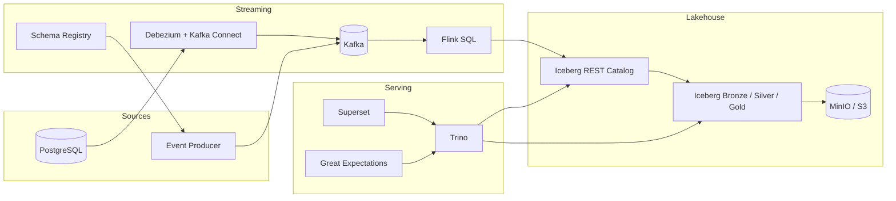

# Realtime Lakehouse Mini Platform (CDC + Streaming + Iceberg)

PostgreSQL OLTP 변경 데이터(CDC)와 애플리케이션 행동 이벤트를 Kafka로 표준화하고, Flink로 정제/집계한 뒤 Iceberg 레이크하우스에 적재해 Trino, Superset, Great Expectations까지 한 번에 데모할 수 있도록 만든 로컬 재현형 미니 플랫폼입니다.

## What You Can Demo

- PostgreSQL `orders / payments / refunds` 변경이 Debezium CDC로 Kafka 토픽에 반영
- 애플리케이션 이벤트(`click / search / add_to_cart`)가 Schema Registry 기반 Avro로 Kafka에 적재
- Flink SQL이 bronze / silver / gold Iceberg 테이블을 스트리밍 갱신
- Trino로 KPI 조회와 Iceberg snapshot / time travel 확인
- Superset에서 KPI 차트 구성
- Great Expectations로 Data Docs 생성

## Architecture



더 자세한 설계는 [docs/architecture.md](C:/clone_repo/Realtime-Lakehouse-Mini-Platform-CDC-Streaming-Iceberg-/docs/architecture.md), [docs/topic-and-schema-design.md](C:/clone_repo/Realtime-Lakehouse-Mini-Platform-CDC-Streaming-Iceberg-/docs/topic-and-schema-design.md), [docs/operations.md](C:/clone_repo/Realtime-Lakehouse-Mini-Platform-CDC-Streaming-Iceberg-/docs/operations.md)에 정리했습니다.

## Quick Start

```powershell
Copy-Item .env.example .env
.\scripts\bootstrap.ps1
.\scripts\seed-postgres.ps1
.\scripts\produce-events.ps1 -Count 120 -IntervalMs 250
.\scripts\run-dq.ps1
```

부팅이 끝나면 아래 엔드포인트를 확인할 수 있습니다.

- Kafka Connect: [http://localhost:8083](http://localhost:8083)
- Schema Registry: [http://localhost:8081](http://localhost:8081)
- Flink UI: [http://localhost:8082](http://localhost:8082)
- Trino: [http://localhost:8080](http://localhost:8080)
- Superset: [http://localhost:8088](http://localhost:8088)
- MinIO Console: [http://localhost:9001](http://localhost:9001)

## Demo Flow

1. `.\scripts\bootstrap.ps1`
2. `.\scripts\seed-postgres.ps1`
3. `.\scripts\produce-events.ps1`
4. Trino에서 [sql/trino/01_demo_queries.sql](C:/clone_repo/Realtime-Lakehouse-Mini-Platform-CDC-Streaming-Iceberg-/sql/trino/01_demo_queries.sql) 실행
5. `.\scripts\run-dq.ps1`

## Core Topics

- `raw.cdc.commerce.public.orders`
- `raw.cdc.commerce.public.payments`
- `raw.cdc.commerce.public.refunds`
- `raw.event.commerce.user_behavior_v3`

## Schema Evolution Demo

대표 시나리오는 `orders.coupon_id` nullable 필드 추가입니다. Schema Registry 글로벌 호환성 정책은 `BACKWARD_TRANSITIVE`로 설정하고, Iceberg는 nullable add-column 중심으로 진화시키도록 설계했습니다.

## Verification Checklist

- `docker compose config` 성공
- Kafka Connect에 `pg-commerce-cdc` 커넥터가 등록됨
- Flink UI에 `commerce_medallion_pipeline` 잡이 보임
- Trino에서 `SHOW TABLES FROM bronze` / `SHOW TABLES FROM gold` 성공
- `quality/great_expectations/uncommitted/data_docs/local_site/index.html` 생성
