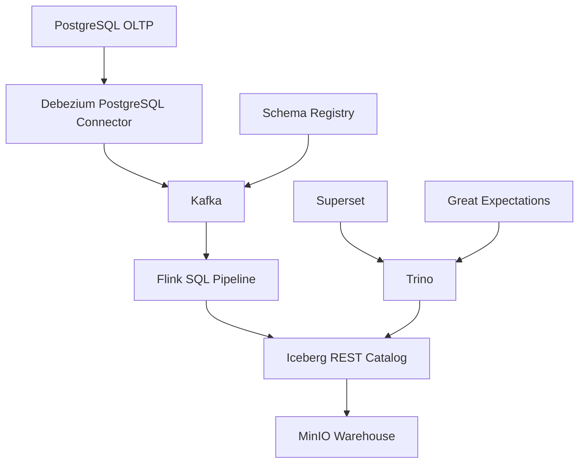

# Architecture Notes

## Goals

- 로컬에서 `docker compose up`으로 재현 가능할 것
- CDC, 이벤트 스트리밍, Iceberg, 대시보드, DQ까지 한 흐름으로 설명 가능할 것
- 클라우드 버전으로 옮길 때 저장 포맷과 운영 개념을 그대로 유지할 것

## Data Flow

1. Postgres `orders`, `payments`, `refunds` 테이블 변경을 Debezium이 감지합니다.
2. Debezium은 Kafka Connect를 통해 `raw.cdc.commerce.public.*` 토픽으로 JSON 이벤트를 발행합니다.
3. 애플리케이션 이벤트는 Python producer가 Avro + Schema Registry 조합으로 `raw.event.commerce.user_behavior_v3` 토픽에 적재합니다.
4. Flink SQL은 Kafka source를 읽어 bronze / silver / gold Iceberg 테이블에 쓰기 작업을 수행합니다.
5. Trino와 Superset은 같은 Iceberg 카탈로그를 통해 조회합니다.
6. Great Expectations는 Trino를 통해 gold 테이블을 검증하고 Data Docs를 생성합니다.

## Diagram

